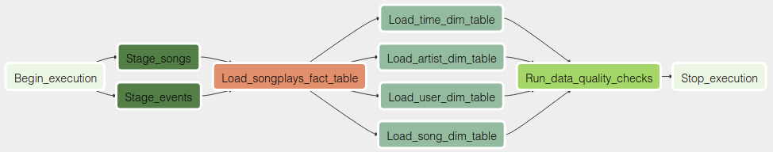
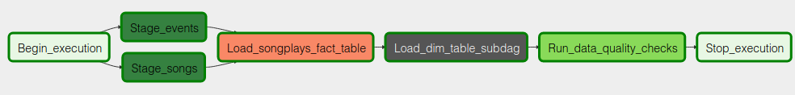

# udacity-nd027-data-pipelines

Project submission for Udacity Data Engineering Nanodegree - Data Pipelines

## Summary
This project combines song listen log files with song metadata to facilitate analytics. JSON data residing in S3 is fed trough a data pipeline defined in Apache Airflow. The pipeline stages data into Redshift before inserting data into suitable tables for analysis. Data quality checks are performed before concluding the pipeline. The end result is a Redshift cluster with data organized into a star schema with fact and dimension tables. Analytics queries on the songplays fact table are straightforward, and additional fields can be easily accessed in the four dimension tables users, songs, artists, and time. A star schema is suitable for this application since denormalization is easy, queries can be kept simple, and aggregations are fast.

## Install

**Python requirements**

```shell
$ pip install -r requirements.txt
```

**Configure Airflow**

In `airflow.cfg` (`~/airflow`) update `dags_folder` and `plugins_folder` to the project subdirectories. Set `load_examples = False`.

**Configure environment**

Choose `DB/PASSWORD` in `redshift.cfg`.

**Create IAM role, Redshift cluster, configure TCP connectivity, and create Redshift tables**
```shell
$ python create_redshift_cluster.py --query_file create_tables.sql
```

### Start Airflow

```shell
$ airflow initdb
$ airflow scheduler
$ airflow webserver
```

### Airflow web UI

Go to Admin > Connections apge and click `Create`.

On the create connection page, enter the following values:

* Conn Id: `aws_credentials`
* Conn Type: `Amazon Web Services`
* Login: `<AWS_ACCESS_KEY_ID>`
* Password: `<AWS_SECRET_ACCESS_KEY>`

Click `Save and Add Another`

* Conn Id: `redshift`
* Conn Type: `Postgres`
* Host: `<Redshift cluster endpoint from redshift.cfg>`
* Schema: `dev`
* Login: `awsuser`
* Password: `<Redshift db password from redshift.cfg>`
* Port: `5439`

### Tear down

**Delete IAM role and Redshift cluster**

```shell
$ python create_cluster.py --delete
```

## Pipeline

**Standard DAG**


**DAG with sub-DAG**

